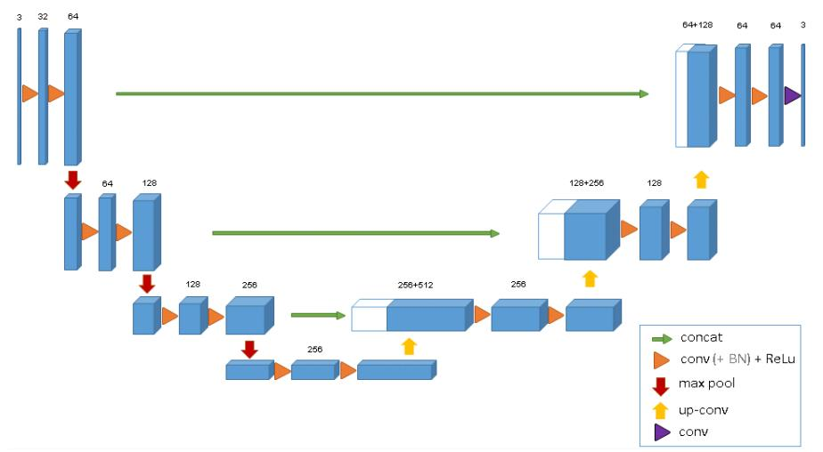

# Contents
- [Contents](#contents)
    - [Unet3D Model Architecture](#unet3d-model-architecture)
    - [Dataset Description](#dataset-description)
    - [Environment Requirements](#environment-requirements)
    - [Script Description](#script-description)
        - [Script and Sample Code](#script-and-sample-code)
        - [Script Parameters](#script-parameters)
    - [Setup](#setup)
        - [Prepare Running Environment](#prepare-running-environment)
        - [Prepare Dataset](#prepare-dataset)
        - [Convert data](#convert-data)
    - [Training Process](#training-process)
        - [Training](#training)
            - [Training on GPU](#training-on-gpu)
            - [Training on Ascend](#training-on-ascend)
        - [Distributed Training](#distributed-training)
            - [Distributed training on GPU](#distributed-training-on-gpu)
            - [Distributed training on Ascend](#distributed-training-on-ascend)  
    - [Evaluation Process](#evaluation-process)
        - [Evaluation](#evaluation)
            - [Evaluating on GPU](#training-on-gpu)
            - [Evaluating on Ascend](#evaluating-on-ascend)
        - [ONNX Evaluation](#onnx-evaluation)
    - [Inference Process](#inference-process)
        - [Infer on GPU](#infer-on-gpu)
        - [Infer on Ascend310](#infer-on-ascend310)
            - [Export MindIR](#export-mindir)
            - [Inference](#inference)
            - [result](#result)
    - [Model Description](#model-description)
        - [Performance](#performance)
            - [Evaluation Performance](#evaluation-performance)
            - [Inference Performance](#inference-performance)
	- [Description of Random Situation](#description-of-random-situation)
	- [Problem Shooting](#problem-shooting)
	- [ModelZoo Homepage](#modelzoo-homepage)


## [Unet3D Model Architecture](#contents)

Unet3D model is created based on the previous Unet(2D), which includes an encoder part and a decoder part. The encoder part is used to analyze the whole picture and extract and analyze features, while the decoder part is to generate a segmented block image. In this model, we also add residual block in the base block to improve the network.

Unet3D model is widely used for 3D medical image segmentation. The construct of Unet3D network is similar to the Unet, the main difference is that Unet3D use 3D operations like Conv3D while Unet is anentirely 2D architecture. To know more information about Unet3D network, you can read the original paper [Unet3D: Learning Dense VolumetricSegmentation from Sparse Annotation](https://arxiv.org/abs/1606.06650).

The following is the structure of original structure of Unet3D. Subsequently, according to the requirements of datasets and different tasks, the network structure can be modified, such as changing the number of input channels to 1



## [Dataset Description](#contents)
Dataset used: [LUNA16](https://luna16.grand-challenge.org/)

Luna16 dataset, fully known as Lung Nodule Analysis 16, is a lung nodule detection dataset launched in 2016. It is designed to be a benchmark for evaluating various CAD (computer aid detection system). It has 10 subfolders, subset0~subset9. Each folder contains cases, and each case corresponds to two files with the same file name and different suffixes. The.mhd file stores the basic information of CT, The.raw file stores the actual CT data.The seg-lungs-LUNA16 folder stores the mask of the lung. We use seg-lungs-LUNA16 as the segment of the lung lobe segmentation task.

The segment of Luna16 is divided into four categories, 0 represents the background, 3 represents the left lung, 4 represents the right lung, and 5 represents the blood vessels. Therefore, this task is actually a four category task.

## [Environment Requirements](#contents)

- Hardware（Ascend or GPU）
    - Prepare hardware environment with Ascend or GPU.
- Framework
    - [MindSpore](https://www.mindspore.cn/install/en)
- For more information, please check the resources below：
    - [MindSpore Tutorials](https://www.mindspore.cn/tutorials/en/master/index.html)
    - [MindSpore Python API](https://www.mindspore.cn/docs/api/en/master/index.html)
- My Environment Example
    - Ubuntu 16.04 LTS, GTX 1050Ti Notebook 4G, Memory 16G, System Swap Memory 8G
    - Cuda 10.1, Nvidia Driver 430
    - Mindspore 1.6.1 GPU version

## [Script Description](#contents)

### [Script and Sample Code](#contents)

```text

.
└─unet3d
  ├── README.md                                 // descriptions about Unet3D
  ├── LUNA16                                    // dataset
  ├── scripts
  │   ├──run_distribute_train.sh                // shell script for distributed on Ascend
  │   ├──run_standalone_train.sh                // shell script for standalone on Ascend
  │   ├──run_standalone_eval.sh                 // shell script for evaluation on Ascend
  │   ├──run_distribute_train_gpu_fp32.sh       // shell script for distributed on GPU fp32
  │   ├──run_distribute_train_gpu_fp16.sh       // shell script for distributed on GPU fp16
  │   ├──run_standalone_train_gpu_fp32.sh       // shell script for standalone on GPU fp32
  │   ├──run_standalone_train_gpu_fp16.sh       // shell script for standalone on GPU fp16
  │   ├──run_standalone_eval_gpu_fp32.sh        // shell script for evaluation on GPU fp32
  │   ├──run_standalone_eval_gpu_fp16.sh        // shell script for evaluation on GPU fp16
  │   ├──run_eval_onnx.sh                       // shell script for ONNX evaluation
  │   ├──run_infer_310.sh                       // shell script for inference on Ascend
  │   ├──run_standalone_infer_gpu_fp32.sh       // shell script for standalone inference on GPU fp32
  ├── src
  │   ├──dataset.py                             // creating dataset
  │   ├──lr_schedule.py                         // learning rate scheduler
  │   ├──transform.py                           // handle dataset
  │   ├──convert_nifti.py                       // convert dataset
  │   ├──loss.py                                // loss
  │   ├──utils.py                               // General components (callback function)
  │   ├──unet3d_model.py                        // Unet3D model
  │   ├──unet3d_parts.py                        // Unet3D part
          ├── model_utils
          │   ├──config.py                      // parameter configuration
          │   ├──device_adapter.py              // device adapter
          │   ├──local_adapter.py               // local adapter
          │   ├──moxing_adapter.py              // moxing adapter
  ├── default_config.yaml                       // parameter configuration
  ├── train.py                                  // training script
  ├── eval.py                                   // evaluation script
  ├── infer.py                                  // inference script
  ├── eval_onnx.py                              // ONNX evaluation script
  ├── Unet3d-10_877.ckpt                        // checkpoint can be used for inference

```

### [Script Parameters](#contents)

Parameters for both training and evaluation can be set in config.py

- config for Unet3d, luna16 dataset

```python

  'model': 'Unet3d',                  # model name
  'lr': 0.0005,                       # learning rate
  'epochs': 10,                       # total training epochs when run 1p
  'batchsize': 1,                     # training batch size
  "warmup_step": 120,                 # warmp up step in lr generator
  "warmup_ratio": 0.3,                # warpm up ratio
  'num_classes': 4,                   # the number of classes in the dataset
  'in_channels': 1,                   # the number of channels
  'keep_checkpoint_max': 5,           # only keep the last keep_checkpoint_max checkpoint
  'loss_scale': 256.0,                # loss scale
  'roi_size': [224, 224, 96],         # random roi size
  'overlap': 0.25,                    # overlap rate
  'min_val': -500,                    # intersity original range min
  'max_val': 1000,                    # intersity original range max
  'upper_limit': 5                    # upper limit of num_classes
  'lower_limit': 3                    # lower limit of num_classes

```


## [Setup](#contents)
### [Prepare Running Environment](#contents)
```shell
# Open terminal and create a new virtual environment.
conda create -n mindspore_1.6.1_gpu_py37 python=3.7
# Activate conda environment.
conda activate mindspore_1.6.1_gpu_py37
# Install the mindspore and other library
conda install mindspore-gpu=1.6.1 cudatoolkit=10.1 -c mindspore -c conda-forge
conda install matplotlib
conda install scikit-image
pip install onnxruntime-gpu
conda install SimpleITK
```
### [Prepare Dataset](#contents)
- Description: The data is to automatically detect the location of nodules from volumetric CT images. 888 CT scans from LIDC-IDRI database are provided. The complete dataset is divided into 10 subsets that should be used for the 10-fold cross-validation. All subsets are available as compressed zip files. Unzip subset0.rar to subset9.rar into “LUNA16/train/image/” and Unzip seg-lungs-LUNA16.rar into “LUNA16/train/seg/”.

- Dataset size：887
    - Train：877 images
    - Test：10 images(last 10 images in subset9 with lexicographical order)
- Data format：zip
    - Note：Data will be processed in convert_nifti.py, and one of them will be ignored during data processing.
- Data Content Structure

```text

.
└─LUNA16
  ├── train
  │   ├── image         // contains 877 image files
  |   ├── seg           // contains 877 seg files
  ├── val
  │   ├── image         // contains 10 image files
  |   ├── seg           // contains 10 seg files
```
### [Convert data](#contents)
```shell
# Convert dataset into mifti format.
python ./src/convert_nifti.py --data_path=/path/to/input_image/ --output_path=/path/to/output_image/
```
For example
```shell
# Convert the image data
python ./src/convert_nifti.py –data_path=./LUNA16/train/image/ --output_path=./LUNA16/train/image/
# Convert the seg data
python ./src/convert_nifti.py –data_path=./LUNA16/train/seg/ --output_path=./LUNA16/train/seg/
```


## [Training Process](#contents)

### Training

#### Training on GPU

```shell
# enter scripts directory
cd scripts
# fp32
bash ./run_standalone_train_gpu_fp32.sh /path_prefix/LUNA16/train
# fp16
bash ./run_standalone_train_gpu_fp16.sh /path_prefix/LUNA16/train
# For example
bash ./run_standalone_train_gpu_fp32.sh ../LUNA16/train
```

The python command above will run in the background, you can view the results through the file `train.log`.

After training, you'll get some checkpoint files under the train_fp[32|16]/output/ckpt_0/ folder by default.

#### Training on Ascend

```shell
python train.py --data_path=/path/to/data/ > train.log 2>&1 &

```

The python command above will run in the background, you can view the results through the file `train.log`.

After training, you'll get some checkpoint files under the script folder by default. The loss value will be achieved as follows:

```shell

epoch: 1 step: 878, loss is 0.55011123
epoch time: 1443410.353 ms, per step time: 1688.199 ms
epoch: 2 step: 878, loss is 0.58278626
epoch time: 1172136.839 ms, per step time: 1370.920 ms
epoch: 3 step: 878, loss is 0.43625978
epoch time: 1135890.834 ms, per step time: 1328.537 ms
epoch: 4 step: 878, loss is 0.06556784
epoch time: 1180467.795 ms, per step time: 1380.664 ms

```

### Distributed Training

#### Distributed training on GPU

```shell
# enter scripts directory
cd scripts
# fp32
bash ./run_distribute_train_gpu_fp32.sh /path_prefix/LUNA16/train
# fp16
bash ./run_distribute_train_gpu_fp16.sh /path_prefix/LUNA16/train

```

The above shell script will run distribute training in the background. You can view the results through the file `/train_parallel_fp[32|16]/train.log`.

After training, you'll get some checkpoint files under the `train_parallel_fp[32|16]/output/ckpt_[X]/` folder by default.

#### Distributed training on Ascend

> Notes:
> RANK_TABLE_FILE can refer to [Link](https://www.mindspore.cn/tutorials/experts/en/master/parallel/train_ascend.html) , and the device_ip can be got as [Link](https://gitee.com/mindspore/models/tree/master/utils/hccl_tools). For large models like InceptionV4, it's better to export an external environment variable `export HCCL_CONNECT_TIMEOUT=600` to extend hccl connection checking time from the default 120 seconds to 600 seconds. Otherwise, the connection could be timeout since compiling time increases with the growth of model size.
>

```shell

bash scripts/run_distribute_train.sh [RANK_TABLE_FILE] [IMAGE_PATH] [SEG_PATH]

```

The above shell script will run distribute training in the background. You can view the results through the file `/train_parallel[X]/log.txt`. The loss value will be achieved as follows:

```shell

epoch: 1 step: 110, loss is 0.8294426
epoch time: 468891.643 ms, per step time: 4382.165 ms
epoch: 2 step: 110, loss is 0.58278626
epoch time: 165469.201 ms, per step time: 1546.441 ms
epoch: 3 step: 110, loss is 0.43625978
epoch time: 158915.771 ms, per step time: 1485.194 ms
...
epoch: 9 step: 110, loss is 0.016280059
epoch time: 172815.179 ms, per step time: 1615.095 ms
epoch: 10 step: 110, loss is 0.020185348
epoch time: 140476.520 ms, per step time: 1312.865 ms

```

## [Evaluation Process](#contents)

### Evaluation

#### Evaluating on GPU

```shell
# enter scripts directory
cd ./script
# fp32, 1gpu
bash ./run_standalone_eval_gpu_fp32.sh /path_prefix/LUNA16/val /path_prefix/train_fp32/output/ckpt_0/Unet3d-10_877.ckpt
# fp16, 1gpu
bash ./run_standalone_eval_gpu_fp16.sh /path_prefix/LUNA16/val /path_prefix/train_fp16/output/ckpt_0/Unet3d-10_877.ckpt
# fp32, 8gpu
bash ./run_standalone_eval_gpu_fp32.sh /path_prefix/LUNA16/val /path_prefix/train_parallel_fp32/output/ckpt_0/Unet3d-10_110.ckpt
# fp16, 8gpu
bash ./run_standalone_eval_gpu_fp16.sh /path_prefix/LUNA16/val /path_prefix/train_parallel_fp16/output/ckpt_0/Unet3d-10_110.ckpt
# For example
bash ./run_standalone_eval_gpu_fp32.sh ../LUNA16/val ./train_fp32/output/ckpt_0/Unet3d-10_877.ckpt
```

#### Evaluating on Ascend

- evaluation on dataset when running on Ascend

Before running the command below, please check the checkpoint path used for evaluation. Please set the checkpoint path to be the absolute full path, e.g., "username/unet3d/Unet3d-10_110.ckpt".

```shell
python eval.py --data_path=/path/to/data/ --checkpoint_file_path=/path/to/checkpoint/ > eval.log 2>&1 &

```

The above python command will run in the background. You can view the results through the file "eval.log". The accuracy of the test dataset will be as follows:

```shell

# grep "eval average dice is:" eval.log
eval average dice is 0.9502010010453671

```

### ONNX Evaluation

- Export your model to ONNX

  ```shell
  python export.py --ckpt_file /path/to/checkpoint.ckpt --file_name /path/to/exported.onnx --file_format ONNX --device_target GPU
  ```

- Run ONNX evaluation

  ```shell
  python eval_onnx.py --file_name /path/to/exported.onnx --data_path /path/to/data/ --device_target GPU > output.eval_onnx.log 2>&1 &
  ```

- The above python command will run in the background, you can view the results through the file output.eval_onnx.log. You will get the accuracy as following:

  ```log
  average dice: 0.9646
  ```

## Inference Process
We can do the inference either on GPU or Ascend310 
### [Infer on GPU](#contents)
```shell
# GPU inference
bash ./run_standalone_infer_gpu_fp32.sh [DATA_PATH] [CHECKPOINT_FILE_PATH]
# For example
bash ./run_standalone_infer_gpu_fp32.sh ../LUNA16/inference/ ../Unet3d-10_877.ckpt
```
The result is saved in scrips/infer_fp32.


### [Infer on Ascend310](#contents)

#### [Export MindIR](#contents)

```shell
python export.py --ckpt_file [CKPT_PATH] --file_name [FILE_NAME] --file_format [FILE_FORMAT]
```

The ckpt_file parameter is required,
`file_format` should be in ["AIR", "MINDIR"]

#### [Inference](#contents)

Before performing inference, the mindir file must be exported by `export.py` script. We only provide an example of inference using MINDIR model.

```shell
# Ascend310 inference
bash run_infer_310.sh [MINDIR_PATH] [NEED_PREPROCESS] [DEVICE_ID]
```

- `NEED_PREPROCESS` means weather need preprocess or not, it's value is 'y' or 'n'.
- `DEVICE_ID` is optional, default value is 0.

#### [result](#contents)

Inference result is saved in current path, you can find result like this in acc.log file.

```shell

# grep "eval average dice is:" acc.log
eval average dice is 0.9502010010453671

```

## [Model Description](#contents)

### [Performance](#contents)

#### Evaluation Performance

| Parameters          | Ascend                                                    |     GPU                                              |
| ------------------- | --------------------------------------------------------- | ---------------------------------------------------- |
| Model Version       | Unet3D                                                    | Unet3D                                               |
| Resource            |  Ascend 910; CPU 2.60GHz, 192cores; Memory 755G; OS Euler2.8 | Nvidia V100 SXM2; CPU 1.526GHz; 72cores; Memory 42G; OS Ubuntu16|
| uploaded Date       | 03/18/2021 (month/day/year)                               | 05/21/2021(month/day/year)                           |
| MindSpore Version   | 1.2.0                                                     | 1.2.0                                                |
| Dataset             | LUNA16                                                    | LUNA16                                               |
| Training Parameters | epoch = 10,  batch_size = 1                               | epoch = 10,  batch_size = 1                          |
| Optimizer           | Adam                                                      | Adam                                                 |
| Loss Function       | SoftmaxCrossEntropyWithLogits                             | SoftmaxCrossEntropyWithLogits                        |
| Speed               | 8pcs: 1795ms/step                                         | 8pcs: 1883ms/step                                    |
| Total time          | 8pcs: 0.62hours                                           | 8pcs: 0.66hours                                      |
| Parameters (M)      | 34                                                        | 34                                                   |
| Scripts             | [unet3d script](https://gitee.com/mindspore/models/tree/master/official/cv/unet3d) |

#### Inference Performance

| Parameters          | Ascend                      | GPU                         | Ascend310                   |
| ------------------- | --------------------------- | --------------------------- | --------------------------- |
| Model Version       | Unet3D                      | Unet3D                      | Unet3D                      |
| Resource            | Ascend 910; OS Euler2.8     | Nvidia V100 SXM2; OS Ubuntu16| Ascend 310; OS Euler2.8    |
| Uploaded Date       | 03/18/2021 (month/day/year) | 05/21/2021 (month/day/year) | 12/15/2021 (month/day/year) |
| MindSpore Version   | 1.2.0                       | 1.2.0                       | 1.5.0                       |
| Dataset             | LUNA16                      | LUNA16                      | LUNA16                      |
| batch_size          | 1                           | 1                           | 1                           |
| Dice                | dice = 0.93                 | dice = 0.93                 | dice = 0.93                 |
| Model for inference | 56M(.ckpt file)             | 56M(.ckpt file)             | 56M(.ckpt file)             |

## [Description of Random Situation](#contents)

We set seed to 1 in train.py.

## [Problem Shooting](#contents)
- Problem 1: there is a bug in the original “unet3d/src/convert_nifti.py”, you should delete the “src.”

## [ModelZoo Homepage](#contents)

Please check the official [homepage](https://gitee.com/mindspore/models).


